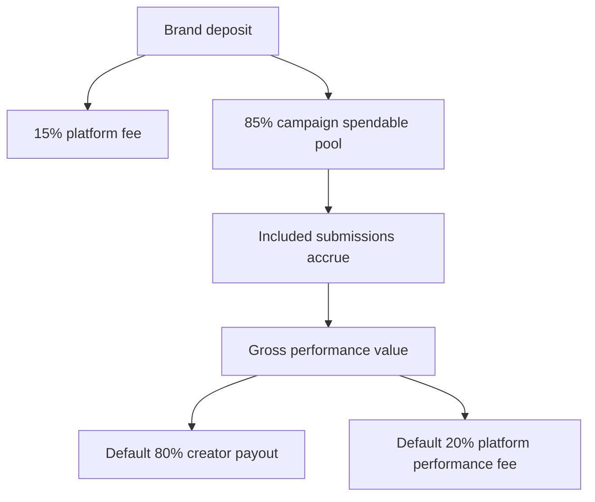

# Business model

**What this file is:** Where Arpify’s **revenue** comes from. Money movement, review steps, refunds, retention: [Creator flow](03-creator-flow.md), [Brand flow](04-brand-flow.md), [Policies and trust](06-policies-and-trust.md).

---

## Revenue streams (complete)

| # | Stream | When it applies | Platform take |
|---|--------|-----------------|----------------|
| 1 | **Funding fee** | Every successful **brand deposit or top-up** into a campaign | **15%** of the payment |
| 2 | **Performance fee (default)** | Each **included** submission line when gross performance is **released** in monthly payout (non-rejected; split locked at submit) | **20%** of **gross** performance on that line |
| 3 | **Performance fee (TikTok yellow basket)** | Same as row 2, but only for TikTok rows where **yellow basket** was declared at submit ([Creator flow](03-creator-flow.md#tiktok-yellow-basket-submit)) | **50%** of **gross** on that line (creator gets **50%**) |

**Notes (fees, not separate streams):**

- **85%** of each deposit/top-up goes to the campaign **spendable** pool (complement of row 1).
- **Refunds** of unused **available** balance **do not** return the **15%** already taken on the original deposit(s).
- Brand-facing rates are **gross** PHP / 1k; creator campaign UI uses the **headline** net (default **80%** of gross) — [Copy](README.md#voice-positioning-and-naming-copywriting).

---

## Key percentages (quick reference)

| Topic | Rule |
|-------|------|
| Deposit / top-up | **15%** platform · **85%** spendable pool |
| Gross performance payout (default) | **20%** platform · **80%** creator |
| Gross performance payout (TikTok yellow basket line) | **50%** platform · **50%** creator |
| Payable stats | Frozen **at submit**; rejection **excludes** a line from pay |

---

## Diagram (default payout split on gross)

TikTok yellow basket lines use **50/50** on gross for that line instead of **80/20**.

---

## Where Arpify makes money (two streams)

Same list as [Revenue streams (complete)](#revenue-streams-complete): **15%** on deposits; **20%** of gross performance per line at payout (default); **50%** of gross on **TikTok yellow basket** lines.

---

## How a campaign's money moves

**1. Funding** — Each deposit/top-up: **15%** platform, **85%** spendable pool. **2. Accrual** — Included (non-rejected) lines use the **submit-time** snapshot. **3. Monthly payout** — Brand **confirms** the batch before send. Detail: [Brand flow](04-brand-flow.md), [Creator flow](03-creator-flow.md).

---

## Xendit xenPlatform (per brand)

**Decision:** Use Xendit **xenPlatform** with **one Owned sub-account per brand** — **not** one sub-account per campaign.

| Topic | Rule |
|-------|------|
| **Account type** | **Owned** — we operate sub-accounts end-to-end; public business details and fee handling follow Xendit’s **Owned** model (partner does **not** automatically get a separate Xendit merchant experience unless we later choose to invite them). |
| **When we create it** | **First successful campaign fund** for that brand: create the sub-account via xenPlatform **Account API** if none exists yet, then persist Xendit’s sub-account / **`for-user-id`** identifier on the **brand** record. |
| **Money in** | Brand deposits and top-ups are created **for that sub-account** (standard Xendit APIs with **`for-user-id`** / xenPlatform scoping) so **balances and transactions** show **per brand** in the Xendit dashboard. |
| **Money out** | Creator **Disbursements** for submissions tied to a brand **debit only that brand’s** sub-account balance — **never cross-brand** (no paying a creator from another brand’s pooled cash). |
| **Campaigns** | **Spendable / reserved / per-campaign** splits stay in our **Postgres ledger**. For Xendit reconciliation and ops, tag each payment and payout with **campaign id** (and related references) in **metadata / reference** fields supported by the APIs we use. |
| **Confirm with Xendit** | After registration, validate **Owned** sub-account **onboarding** (e.g. account holder rules), **PHP** product mix, and **transfer / split** patterns for the **15%** platform fee vs brand pool — implement to match what they approve. |

---

## 2. Submission and lock-in

Stats (**views, engagement**, etc.) are **frozen at submit**. Brands **reject** to exclude a line from pay. **TikTok yellow basket** at submit locks **50/50** vs **80/20** on gross for that line. Detail: [Creator flow](03-creator-flow.md), [Policies — launch defaults](06-policies-and-trust.md#launch-policies) (caps vs snapshots).

---

## 4. Monthly payout

Included earnings stack; **one monthly batch** per creator; brand **reviews and confirms** before disbursement ([Brand flow](04-brand-flow.md)).

---

## Brand refunds — available only

Refund only **available** (not **reserved**) balance. The **15%** fee on deposits already taken is **not** returned on routine refunds. More: [Policies](06-policies-and-trust.md).
