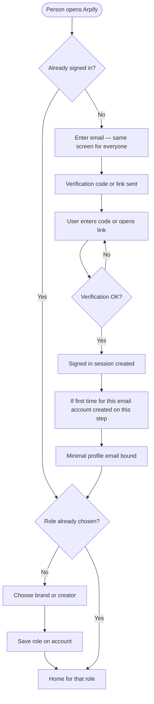

# Auth & sign-in

**Purpose:** We give everyone a single entry: **email** (and optional **Google**), **verification**, then **Brand** or **Creator**. Same pattern for sign-up and log-in. **MVP = one role per account.**

**Related:** Role names and UI copy → [Copy and naming (roles)](README.md#voice-positioning-and-naming-copywriting). After sign-in, routes split into [Creator flow](03-creator-flow.md) and [Brand flow](04-brand-flow.md). JWT and route checks → [Tech stack](05-tech-stack.md).

---

## Email, verification, and account

| Rule | Detail |
|------|--------|
| **One screen** | We don’t separate "Create account" vs "Log in." The **user enters email** (and may use **Continue with Google** if we ship it). We send **verification** (code or magic link). After verification succeeds, they’re **signed in**. New email → we create the account on **first successful verification**. Existing email → same step = **log in**. Example copy: *"We'll send you a code to continue."* |
| **Verification** | We implement resend, rate limits, expiry. |
| **Profile** | At least **email** (and **name** if from a provider). We collect creator **payout** details when they set up how they get paid. Brands don’t need TikTok/Meta OAuth in MVP. |

---

## Role: Brand or Creator

If **no role** is set yet → the **user chooses Brand or Creator** → we save it on the account → we route them to the right **home**.

| Role | Where they land |
|------|------------------|
| **Brand** | Brand home / brand UI |
| **Creator** | Creator home |

---

## Who can see what

| State | Access |
|-------|--------|
| Not signed in | Public + sign-in only |
| Signed in as **Brand** | Brand routes only |
| Signed in as **Creator** | Creator routes only |

On the backend we validate Supabase **JWT**, **Brand** vs **Creator** on protected routes, and **ownership** of campaigns/submissions — see [Tech stack — API trust boundary](05-tech-stack.md).

---

## Optional Google sign-in

After the provider proves identity → we attach to an existing email or create an account → **role selection** if needed. **We pick one MVP policy:** provider is enough on its own, **or** we also require email verification for some actions — we document it.

---

## Flowchart (open app → home)

If this doesn’t render in preview, we paste into [mermaid.live](https://mermaid.live).

---

## Next: role-specific product flows

| Doc | Covers |
|-----|--------|
| [03-creator-flow.md](03-creator-flow.md) | Browse, TikTok/Meta OAuth on profile, submit, earnings, retention (after someone is a **Creator**) |
| [04-brand-flow.md](04-brand-flow.md) | Campaigns, fund, publish, **reject** to exclude, monthly payout review (after someone is a **Brand**) |
