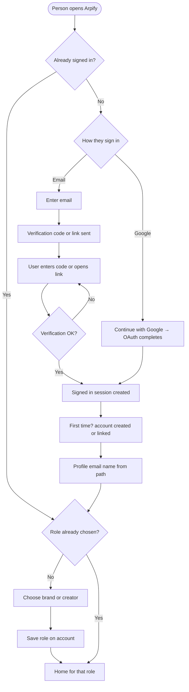

# Auth & sign-in

**Purpose:** One **auth screen** for everyone: sign in with **email** (verification code or magic link) **or** **Continue with Google**. After identity is established, **verify** (email path only — handled by the email step) and choose **Brand** or **Creator**. Same mental model for sign-up and log-in. **MVP = one role per account.**

**Related:** Role names and UI copy → [Copy and naming (roles)](README.md#voice-positioning-and-naming-copywriting). After sign-in, routes split into [Creator flow](03-creator-flow.md) and [Brand flow](04-brand-flow.md). JWT and route checks → [Tech stack](05-tech-stack.md).

---

## Email vs Google (same screen)

| Method | What the user does | What we get | Notes |
|--------|-------------------|-------------|--------|
| **Email** | Enters **email** on the same screen used for everyone. We send **verification** (code or magic link). They enter the code or opens the link. | **Session** after successful verification. **New** address → account created on **first successful verification**. **Existing** address → same flow = **log in**. Example copy: *"We'll send you a code to continue."* | We implement **resend**, **rate limits**, **expiry**. |
| **Google** | Clicks **Continue with Google**. Completes **Google OAuth** in the provider flow (redirect or popup, per integration). | **Session** when Google returns successfully. Profile picks up **email** and **name** (and **avatar** if available) from the provider. **Link** to an existing account or **create** one by verified Google email. | No separate email verification step for this path — **Google already proved** identity for that email. |

**Unified rules**

| Rule | Detail |
|------|--------|
| **One screen** | We don’t separate "Create account" vs "Log in." Email **or** Google — whatever completes first wins for that visit. |
| **Profile** | At least **email** (and **name** when available from email onboarding or Google). Creators add **payout** details when they set up how they get paid. Brands don’t need TikTok/Meta OAuth in MVP. |
| **Account linking** | If someone first signed up with **email** and later uses **Google** with the **same** email (or the reverse), backend policy decides **merge vs block** — document the chosen MVP rule in implementation (Supabase handles `identities` / linking). |

---

## Role: Brand or Creator

If **no role** is set yet → the **user chooses Brand or Creator** → we save it on the account → we route them to the right **home**.

| Role | Where they land |
|------|----------------|
| **Brand** | Brand home / brand UI |
| **Creator** | Creator home |

---

## Who can see what

| State | Access |
|-------|--------|
| Not signed in | Public + sign-in only |
| Signed in as **Brand** | Brand routes only |
| Signed in as **Creator** | Creator routes only |

On the backend we validate Supabase **JWT**, **Brand** vs **Creator** on protected routes, and **ownership** of campaigns/submissions — see [Tech stack — API trust boundary](05-tech-stack.md).

---

## Flowchart (open app → home)

If this doesn’t render in preview, we paste into [mermaid.live](https://mermaid.live).

---

## Next: role-specific product flows

| Doc | Covers |
|-----|--------|
| [03-creator-flow.md](03-creator-flow.md) | Browse, TikTok/Meta OAuth on profile, submit, earnings, retention (after someone is a **Creator**) |
| [04-brand-flow.md](04-brand-flow.md) | Campaigns, fund, publish, **reject** to exclude, monthly payout review (after someone is a **Brand**) |
