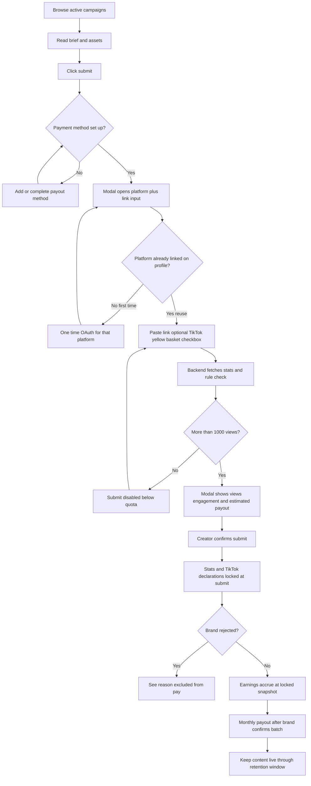
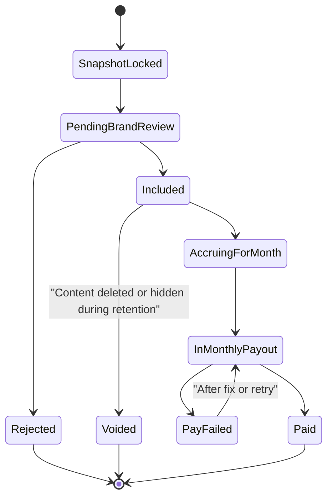
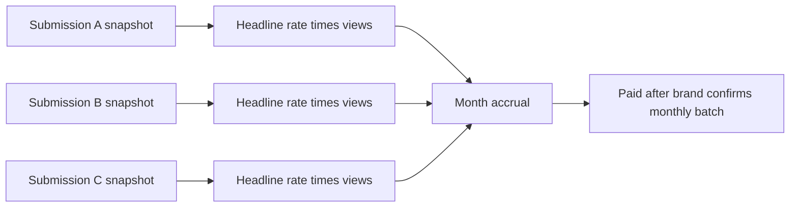

# Creator flow — MVP

**Scope:** Browse, **payout method** before submit, **one-time-per-platform** TikTok/Meta connect, **minimum 1,000 views** on the post at submit (campaign **1k views quota**), submit (stats locked at submit), **TikTok-only yellow basket declaration** when applicable, track status, monthly pay, **retention** window. Money rules: [Business model](01-business-model.md). APIs (tokens, fetch, ownership): [Tech stack — TikTok & Meta](05-tech-stack.md#tiktok-and-meta-integration).

---

## Sign-in (creator)

1. Creators complete [Auth & sign-in](02-auth-and-signin.md): email, verification, then choose **Creator** → we route them to **creator** home.
2. **Email** is required; **name** when we have it (e.g. from Google). We collect **payout** fields when they set up how they get paid.
3. **TikTok/Meta OAuth** isn’t part of email sign-in. They connect in settings or the first time they submit ([Connect TikTok and Meta](#connect-tiktok-and-meta)).

---

## End-to-end (overview)

---

## Creator access recap

**Routes** (see [who can see what](02-auth-and-signin.md#who-can-see-what)): signed-in **creators** only see creator UI. **OAuth** is stored **per creator**; the first time they submit **content** on a platform may open **Connect**; **later** submits on that platform **skip** OAuth if the link still works ([Connect TikTok and Meta](#connect-tiktok-and-meta)). Campaign **[Platforms](04-brand-flow.md#campaign-fields)** set which channel each submission may use.

---

## Connect TikTok and Meta

**MVP rule:** **Optional** for **browse**. **At most one** OAuth link per **platform** (TikTok, Meta) per Arpify account. After connect, binding **stays on profile** (tokens refreshed in background). **Every later submit** on that platform uses it — **not** a new login per campaign. **Reconnect** only if token fails, provider revokes, or user disconnects ([Edge cases](06-policies-and-trust.md#edge-cases)).

**Campaign rule:** Submission platform must be in that campaign’s **[Platforms](04-brand-flow.md#campaign-fields)**. Example: **TikTok-only** campaign ⇒ TikTok must be linked (first submit can run OAuth once). **Facebook-only** ⇒ Meta. **Both** enabled ⇒ either channel per submission, using the right stored link.

**Why OAuth exists:** Email login does not prove who posted the video. OAuth ties the **person’s** TikTok/Facebook account so Arpify can check **author** and **read stats** at submit ([Trust rules](06-policies-and-trust.md#trust-rules)).

**What the creator does in the product**

| Step | Behavior |
|------|----------|
| **Optional early** | In settings, connect TikTok and/or Meta before submitting |
| **First submit on a platform** | If not linked → **one** OAuth in the modal, then continue |
| **Later submits** | If linked and token OK → modal goes straight to **paste link** |
| **Reconnect** | After failure / revoke / disconnect → next submit shows **Connect** again |

**Ownership at submit:** Paste link → API resolves **author** → must match saved **`platform_user_id`**. Else: block with a clear error (e.g. *This post is not from the connected account*).

Token storage, refresh, scopes: [Tech stack — TikTok & Meta integration](05-tech-stack.md#tiktok-and-meta-integration).

---

## TikTok yellow basket (submit)

When **platform** is **TikTok**, the submit modal includes an optional checkbox: **This content has yellow basket**. Creators tick it when the post uses TikTok’s yellow basket / shop-style surface. **Meta (Facebook)** submits do not show this control.

The checkbox value is stored on the **submission record** and is fixed at the same moment as **stats lock-in** (when the creator confirms submit) — not editable afterward through the MVP creator UI.

**Performance split on that line:** Default gross performance uses **80%** creator / **20%** platform on the performance slice ([Business model — two streams](01-business-model.md#where-arpify-makes-money-two-streams)). If **yellow basket** is checked for that TikTok submission, that line uses **50%** creator / **50%** platform on gross performance instead (campaign pool and brand gross rates unchanged; only how gross performance is split between creator and platform for that row).

Misrepresentation (commerce post left unchecked to keep the higher creator share) is a **trust/policy** matter — enforcement and copy live with [Policies and trust](06-policies-and-trust.md).

---

## The submit flow (detailed)

Pay is fixed from the **moment of submit** — not from later growth.

| # | Step |
|---|------|
| 1 | **Submit** from campaign card or detail — **blocked** until a **payout method** is on file (add in settings or in-flow when they first try) |
| 2 | Modal: **platform** (only options allowed by campaign) + **content link**. Submit disabled until link validates and checks pass |
| 3 | **TikTok only** (same modal, before confirm): optional **This content has yellow basket** (hidden on Meta). Optional — **not** required to submit — but when checked it **locks the 50/50 vs 80/20** creator/platform split on **gross** for this row at confirm (see [TikTok yellow basket](#tiktok-yellow-basket-submit)) |
| 4 | **After the link validates:** backend **ownership** (author = connected account); **fetch** views, likes, comments; **reject if views ≤ 1,000** (campaign **1k views** quota); **rule check** vs campaign rules (AI or simpler rules) |
| 5 | Modal shows: **stats**; **estimated payout if not rejected** (default **headline** rate × locked snapshot — **or** the **yellow-basket net** when that box is checked on TikTok); **rule result**: pass / soft-flag / **hard-block** (hard-block keeps Submit off, with reason) |
| 6 | Creator clicks **Submit** → **snapshot locked** (stats plus **TikTok yellow basket** flag when applicable); later view changes **do not** change this payout |
| 7 | Short in-product note (one-time per creator or always brief): *Your stats are locked in. Keep this content live until the campaign ends or for at least one month after submission, whichever is later. If you delete or hide it before then, you forfeit this submission’s earnings.* |

**Gates (all must pass):** **Payout method** on file; platform enabled for campaign; platform linked (or OAuth in flow); author matches; **views > 1,000** (from fetch — sub-threshold links cannot submit); rules allow submit (no hard-block). **Yellow basket** is **not** a gate — optional; it only sets which **creator/platform split** is locked for that TikTok row.

---

## One submission's possible states

---

## Earnings mental model

Each **included** (not rejected) submission accrues from its **locked snapshot** using the campaign’s **gross** performance math. **Campaign** surfaces show the **default** headline (80% of brand gross per 1k); **each row’s** creator **net** uses the split **locked at submit** — **80/20** on gross performance by default, or **50/50** for TikTok with **yellow basket** checked ([TikTok yellow basket](#tiktok-yellow-basket-submit)). Lines add up through the month; one **monthly** batch; brand **reviews the breakdown and confirms** before pay ([Monthly payout](01-business-model.md#4-monthly-payout)).

**Per submission row:** status (included / rejected / voided); **locked snapshot**; estimated or confirmed earnings (headline / creator net according to default or yellow-basket split); **TikTok yellow basket** flag when applicable; **retention** end date.

**Earnings page:** we show this month’s **accrued** total; **paid** history; **next payout** date/status and whether the brand has **confirmed** the batch.

---

## Content retention

**Included** submission (not rejected by brand): content must stay **public** until:

> **The later of (a) campaign end, or (b) one full month after submit.**

Delete, private, or takedown **before** that ⇒ **void**; earnings **forfeit**; reserved money back to brand **available**. **UI:** we say this at submit and on the submission card. Enforcement: [Policies — Content retention](06-policies-and-trust.md#content-retention).

---

## Step-by-step (short)

1. **Browse** — OAuth optional; after first connect, settings show **Connected**; later submits skip connect unless reconnect needed.
2. **Payout method** — Required before submit (settings or first-time flow when they try to submit).
3. **Submit** — Modal → channel + link → **if TikTok, optional yellow basket** → fetch, ownership, **1k+ views**, rules → estimate → confirm → lock snapshot (stats + declarations).
4. **Track** — Status, snapshot, payout estimate/confirm, retention date.
5. **Get paid** — Accrues monthly; batch runs; **brand confirms** → payout (no per-submit instant pay).
6. **Keep post live** through retention window.
