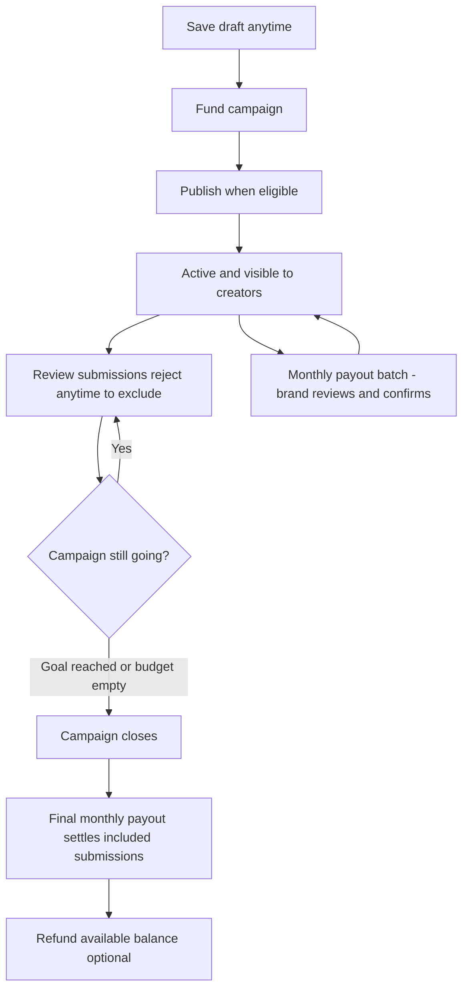
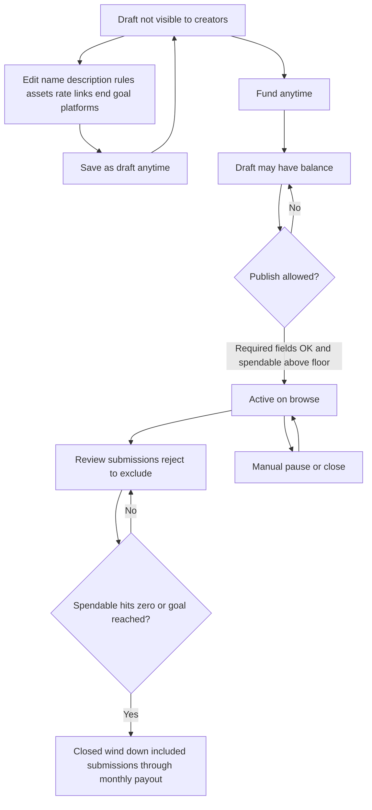
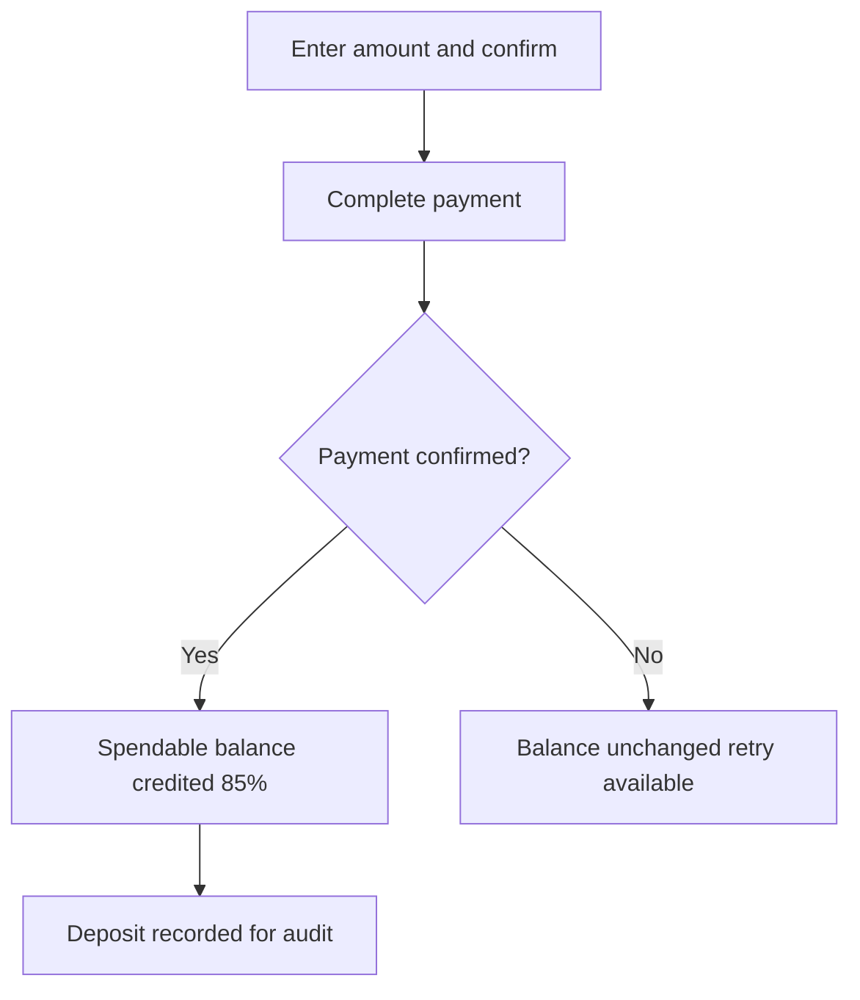
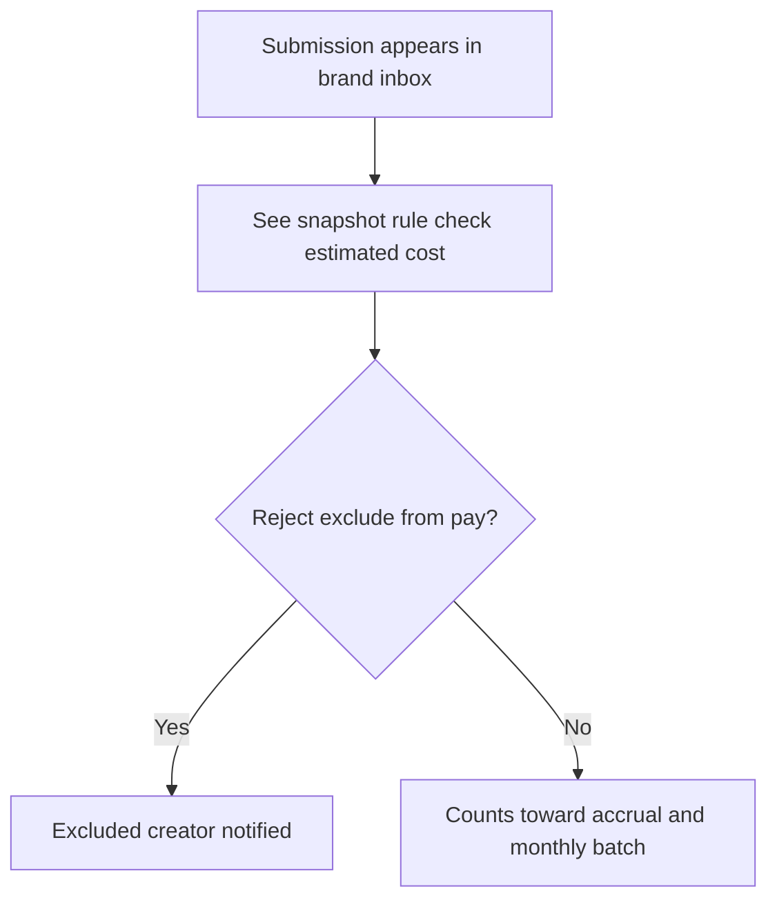

# Brand flow — MVP

**Scope:** Draft campaigns, fund, publish; submissions **count by default** — brands **reject** to exclude; **monthly** payout review and confirm. Money: [Business model](01-business-model.md). Ops and edge cases: [Policies and trust](06-policies-and-trust.md).

---

## Sign-in (brand)

1. Brands complete [Auth & sign-in](02-auth-and-signin.md): email, verification, then choose **Brand** → we route them to **brand** home.
2. **Email** is required; **name** if the provider supplies it.
3. Brands don’t connect TikTok or Meta OAuth in MVP — in the product they **fund**, **review**, and **reject to exclude** only.

---

## Brand access recap

**Routes** (see [who can see what](02-auth-and-signin.md#who-can-see-what)): signed-in **brands** only see brand UI. **Drafts** never appear on creator browse. A brand only manages **their own** campaigns.

---

## Brand — end-to-end

| # | Step |
|---|------|
| 1 | **Draft** — name, description, rules, assets, rate, optional links, end/goal, platforms (Facebook / TikTok) |
| 2 | **Fund** — 15% Arpify, 85% to spendable pool |
| 3 | **Publish** when validation passes and spendable ≥ [publish floor](06-policies-and-trust.md#launch-policies); campaign visible to creators |
| 4 | Submissions **count by default**; brand may **reject** to exclude **in real time** or when **reviewing the monthly breakdown** before payout; stats **locked at submit** |
| 5 | **Monthly payout** — Arpify prepares batch; brand **reviews the breakdown and confirms** before send (can **reject** from that review). **No** weekly batches; **no** per-submission pay button for creators |
| 6 | **Close** when goal hit, pool empty, or manual close; **refund** remaining **available** if any |

---

## Campaign lifecycle

**Publish allowed** = required fields complete ([Campaign fields](#campaign-fields)); spendable ≥ floor; brand clicks **Publish**. Until then, creators don’t see the campaign.

---

## Campaign fields

| Area | MVP |
|------|-----|
| **Campaign name** | Required before **Publish** |
| **Description** | Required before **Publish** |
| **Rules** | Required before **Publish**; **auto-check** at submit vs these rules ([Submit flow](03-creator-flow.md#the-submit-flow-detailed)) |
| **Assets** | Required before **Publish** — files/links makers need |
| **Funds** | **Gross** PHP per 1k + payments; **spendable** after 15% ([Revenue](01-business-model.md#where-arpify-makes-money-two-streams)). Creators see **default headline** = 80% of gross on campaign list/detail ([Copy](README.md#voice-positioning-and-naming-copywriting)); **TikTok yellow basket** rows settle at **50%** creator share of gross performance on that submission ([Creator flow](03-creator-flow.md#tiktok-yellow-basket-submit)). May fund in **Draft** |
| **Links** | Optional — reference posts, product pages, tracking URLs |
| **End / Goal** | **One** mode: run until **goal** or **spendable runs out** or brand closes. MVP default goal = spendable exhausted. Optional hard caps (views/spend) can be a later addition |
| **Platforms** | **One or both** of Facebook and TikTok (**≥1** to publish). Submissions only from enabled platforms; creator must have a **working** OAuth for that platform ([Creator OAuth](03-creator-flow.md#connect-tiktok-and-meta)). **No** other platforms in MVP |

**Draft**

- Save anytime; **draft** only in the **brand UI** (never on creator browse).
- **Fund** / **top up** in Draft; same 15% / 85% ([Funding](01-business-model.md#how-a-campaigns-money-moves)).
- **Publish** is explicit: checks fields + floor → **Active**.
- After publish, edits depend on policy. **Rate locked at publish** — change rate ⇒ **new campaign**.

**Not in MVP for brands:** deep ROI analytics, big org features, weekly payout review, platforms other than FB/TikTok. **Refunds** of **available**: yes ([Brand refunds](01-business-model.md#brand-refunds-available-only)).

---

## Funding a campaign

Brand enters amount → payment clears → spendable updates. **15%** Arpify; **85%** pool. Console shows **gross** and **net credited**.

Detail: [Business model](01-business-model.md).

---

## Reviewing submissions

Submissions arrive **one at a time** — **no** weekly review batch. **By default every submission counts** toward payout; the brand does **not** “approve” each one. The only exclusion action is **Reject** (exclude from pay).

**When to review:** **In real time** in the inbox as **content** arrives, and/or **again in the monthly payout breakdown** before the brand **confirms** release — same **reject** action if they want to exclude a line before money moves.

**Brand sees:** creator; link + preview; **locked snapshot** (views, likes, comments); **TikTok yellow basket** flag when set; **estimated gross cost** and gross / creator net / platform fee (**default** **80% / 20%** on gross performance for the line, or **50% / 50%** when yellow basket applies — [Business model — performance split](01-business-model.md#where-arpify-makes-money-two-streams)); **rule check** — pass / soft-flag / hard-block (hard-blocks usually never reach brand; soft-flags show for judgment).

**Actions:** **Reject** (+ reason) **excludes** the submission from pay and notifies the creator. **No separate Approve** — lines that stay **not rejected** **accrue** toward the next monthly batch.

| Situation | Money |
|--------|--------|
| **Not rejected** | Gross slice is **included**: moves **available → reserved** per policy (e.g. when the line is finalized for the batch); creator line queued for **next monthly** payout |
| **Rejected** | **Excluded** — no pay. If the line was already **reserved** (e.g. reject during pre-payout review): reserved returns to **available** |

---

## Monthly payout (what the brand sees)

Once per month Arpify builds the batch. Brand **reviews** the breakdown and **confirms** before any send.

**Per campaign**

- Accrued payout this cycle (**included**, not yet settled)
- **Batch review** — per creator, per line, gross vs net vs fee; what leaves the pool on confirm
- **Last cycle** — what already left the pool, with detail for audit
- **Per line:** snapshot, gross, creator net and platform fee (**80% / 20%** by default on gross performance; **50% / 50%** when **TikTok yellow basket** — [Creator flow](03-creator-flow.md#tiktok-yellow-basket-submit)), status (queued / confirmed / paid / failed)

Failed payout to a creator: line stays **reserved**; retry per policy ([Edge cases](06-policies-and-trust.md#edge-cases)). Brand may see **retries** in a later batch.

---

## Brand decision points (summary)

| # | Decision | Effect |
|---|----------|--------|
| 1 | **Fund** | Money in |
| 2 | **Publish** | Campaign live for creators |
| 3 | **Reject** (exclude) | Anytime before payout **confirm** — inbox or breakdown |
| 4 | **Confirm monthly payout** | Required before disbursement |
| 5 | **Refund** | Only **[available](01-business-model.md#brand-refunds-available-only)** |
| 6 | **Pause / close** | Stop new submits as defined |

Snapshot lock and monthly batch rules: [Monthly payout](01-business-model.md#4-monthly-payout).
