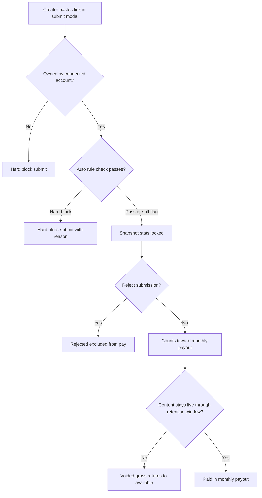

# Policies, trust, critical paths, edge cases

**Scope:** Defaults for **launch**, **trust** rules before money moves, **rollout** order, **critical paths**, **edge cases**, **ops** checklist. Money math: [Business model](01-business-model.md). OAuth, fetch, liveness: [Tech stack](05-tech-stack.md).

---

## Trust pipeline (order of checks)

---

## Rollout order

1. **Sign-in** → role → correct home. Creators **browse** without OAuth; OAuth **once per platform**, stored, reused for later submits.
2. Brands: **draft**, **fund**, **top up**, **refund available**, **publish** when eligible (Facebook / TikTok only).
3. Creators **submit** with snapshot + rule check; submissions **count by default**; brands **reject** only to **exclude**.
4. **Liveness** checks on **included** content through the retention window.
5. **Monthly** payout batch: brand **reviews and confirms**, then disbursement; creators see paid vs accrued.

---

## Launch policies

Shared defaults for product, ops, finance.

| Topic                             | Decision                                                                                                                                                                                                                                                                                                                                                                                                                                                                          |
| --------------------------------- | --------------------------------------------------------------------------------------------------------------------------------------------------------------------------------------------------------------------------------------------------------------------------------------------------------------------------------------------------------------------------------------------------------------------------------------------------------------------------------- |
| **Payout form — create campaign** | **Brand rate per 1,000 views (₱):** minimum **PHP 35**. **Total budget (₱):** minimum **PHP 10,000** — [Brand flow](04-brand-flow.md#payout-create-campaign)                                                                                                                                                                                                                                                                                                                      |
| **Minimum fund to go active**     | **PHP 10,000** **spendable** in the campaign pool (85% of what clears from deposits after the **15%** platform fee). Independent of the **Total budget** field minimum above; a brand may need to **fund or top up** until spendable hits this floor to **Publish**                                                                                                                                                                                                               |
| **Campaign balance hits zero**    | **Auto-pause** — no new submissions; creators see inactive until top-up. **Included** lines still pay on **next** monthly cycle                                                                                                                                                                                                                                                                                                                                                   |
| **Payout cadence**                | **Monthly**. Brand **reviews and confirms** batch before send. **No** weekly package; **no** unattended sweep                                                                                                                                                                                                                                                                                                                                                                     |
| **View settlement**               | Pay from **locked snapshot at submit**. Later growth or corrections **do not** change pay                                                                                                                                                                                                                                                                                                                                                                                         |
| **Brand rejects after inclusion** | Submission **excluded**; reserved gross → **available**. If payout already sent → **dispute** off-product                                                                                                                                                                                                                                                                                                                                                                         |
| **Campaign end**                  | One mode: until **goal** or **spendable exhausted** or brand closes. MVP default goal = spendable out. On end: no new submits; **included** lines pay on next monthly cycle                                                                                                                                                                                                                                                                                                       |
| **Draft vs published**            | Draft **never** on creator browse. Published only after **Publish** + checks pass                                                                                                                                                                                                                                                                                                                                                                                                 |
| **Creator-visible rate**          | Brand sets **gross** per 1k. Creators see **default headline** = **80%** as **the** campaign rate on list/detail ([Copy](README.md#voice-positioning-and-naming-copywriting)). **Per submission**, creator net on gross performance follows submit-time lock: **80/20** default or **50/50** for **TikTok [yellow basket](03-creator-flow.md#tiktok-yellow-basket-submit)**. Brands see full split per line. Terms may still list fees                                            |
| **Brand refund**                  | Only **[available](01-business-model.md#brand-refunds-available-only)**. **Reserved** = **included**, not yet paid. **15%** platform fee not returned on routine refunds. Auto-pause if spendable **< publish floor** while **Active**                                                                                                                                                                                                                                            |
| **Content retention**             | Every **included** submission’s content must stay **published** until the **later of (a) the campaign ending, or (b) one full month after submission**. Earlier deletion or private mode ⇒ void + forfeit. **Liveness** probe ([Tech stack — liveness](05-tech-stack.md#content-liveness-checks-replaces-the-old-metrics-polling))                                                                                                                                                |
| **Rate immutability**             | Rate **locked at publish**. Change ⇒ new campaign                                                                                                                                                                                                                                                                                                                                                                                                                                 |
| **Campaign caps vs snapshots**    | Stats freeze **at submit**. Payable views/gross use the locked snapshot and the cap/balance **shown at submit confirmation**; freed capacity from rejects does **not** retroactively raise pay on pending lines — only **new** submissions after the free-up ([Submission and lock-in](01-business-model.md#2-submission-and-lock-in)). After an **included** line is **finalized**, we do **not** silently increase it when others reject later unless we ship an amendment flow |
| **Creator verification**          | TikTok/Meta OAuth on profile, reused — not per campaign. First submit may connect; later automatic if tokens OK                                                                                                                                                                                                                                                                                                                                                                   |

---

## Trust rules

We can’t prove “organic” with certainty. Our MVP uses: **(A)** hard rules at submit, **(B)** stats from the **platform API** (not typed by the user), **(C)** rule checker vs brief, **(D)** **brand reject** as human gate — submissions **count unless rejected**.

### Submission legitimacy (is this the right post for this campaign?)

Before snapshot:

- **Platform** in campaign **[Platforms](04-brand-flow.md#campaign-fields)**; creator has **healthy** OAuth (or completes in-flow). **Author** must match **`platform_user_id`** — else hard-block.
- **URL shape:** Facebook/TikTok only; patterns Product defines.
- **Public** post.
- **One** canonical post id per campaign (no duplicate submit).
- **Timing:** post date not before campaign active (timezone grace if allowed).
- **TikTok yellow basket:** optional checkbox when platform is TikTok — declares shop/commerce surface and locks **50/50** performance split on gross for that line ([Creator flow](03-creator-flow.md#tiktok-yellow-basket-submit)).

### Rule check (auto vs campaign `Rules` text)

Fetch caption, hashtags, transcript if any, media when possible → matcher (LLM and/or rules). Result:

| Result           | Meaning                                        |
| ---------------- | ---------------------------------------------- |
| **`pass`**       | Proceed; brand may **reject** later to exclude |
| **`soft_flag`**  | Proceed; brand sees reason at review           |
| **`hard_block`** | Submit disabled; creator sees fixable reason   |

Checker **supports** the brand; **default** remains **included**; brand **rejects** to **exclude**.

### Brand review and reject (exclude)

Submissions **count toward payout by default**. The brand may **reject** to **exclude** from pay — **in real time** and/or when **reviewing the monthly payout breakdown** before confirming release ([Brand flow](04-brand-flow.md#reviewing-submissions)). **Reject** → no pay for that line. Lines **not rejected** **accrue** toward the monthly batch per [Business model](01-business-model.md).

### Source of truth for stats

**API at submit time** only — not user-typed numbers. No polling for **payout** because pay does not follow growth.

---

## Content retention

**Included** (non-rejected) submissions: keep content **public** until:

> **The later of (a) campaign end, or (b) one full month after submit.**

| Item                             | Rule                                                                                                               |
| -------------------------------- | ------------------------------------------------------------------------------------------------------------------ |
| **Check**                        | Daily **liveness** probe ([Tech stack](05-tech-stack.md#content-liveness-checks-replaces-the-old-metrics-polling)) |
| **Fail** (delete, private, etc.) | **Void**; reserved → **available**; notify creator                                                                 |
| **Transient errors**             | Retry with backoff; void only after **threshold** (e.g. N consecutive fails over M hours)                          |
| **Disputes**                     | Creator can ask review if post was actually live; ops may un-void within a defined window                          |
| **After window**                 | Settled — creator may remove content; no more probes                                                               |

---

## Critical paths

| Path                               | Good outcome                                                                          | How                                                                                                                               |
| ---------------------------------- | ------------------------------------------------------------------------------------- | --------------------------------------------------------------------------------------------------------------------------------- |
| **A. Access**                      | Email verified → session → Brand or Creator → only allowed routes                     | JWT + role + ownership on **writes** (create/update/delete); one role per account for MVP                                         |
| **A2. Creator platforms**          | Stored OAuth + campaign platform rules                                                | Submission platform must match the campaign’s allowed list; author match; first-time OAuth in modal if needed                     |
| **B. Money in**                    | One cleared payment → one 85% credit                                                  | **Per-brand** xenPlatform sub-account (`for-user-id`); invoices/webhooks so **duplicates don’t double-credit**; store gross/fee/net + **campaign** reference for reconcile; never bump balance from the client alone |
| **C. Publish**                     | Live only with full fields + spendable ≥ floor                                        | Single backend publish + validation + audit log                                                                                   |
| **D. Submit**                      | Snapshot from API, ownership OK, rule check done, snapshot saved before brand sees it | Run the full [submit pipeline](05-tech-stack.md#submit-time-pipeline) as one unit of work; enable Submit only when done           |
| **E. Include by default / reject** | Submissions **count** unless **rejected**; reject voids / excludes                    | One clear API path for **reject**; **repeat calls don’t double** effects; notify creator                                          |
| **F. Liveness**                    | Content public through retention or void                                              | Daily probe; retry policy; return reserved on void                                                                                |
| **G. Monthly payout**              | Batch built; brand confirms; then pay                                                 | Schedule + confirmation gate; **each line paid once**; export for finance to reconcile                                            |
| **H. Refund**                      | Only **available**                                                                    | Enforce available cap; **handle refunds and reject/void in order** so balances don’t race; auto-pause if below floor after refund |

---

## Edge cases

### Identity and verification

| Case                                          | What we do                                                                                                                                                   |
| --------------------------------------------- | ------------------------------------------------------------------------------------------------------------------------------------------------------------ |
| Code expired / wrong                          | Clear errors; resend with limits; lockout after N; support reset                                                                                             |
| Wrong role picked                             | [Copy](README.md#voice-positioning-and-naming-copywriting) + “Not sure?”; support flips role before first payout (MVP); optional payout hold if fraud signal |
| Google sign-in, email not verified for payout | Require verified email or phone before first creator payout; document in Terms                                                                               |

### Creator platform OAuth (TikTok / Facebook)

| Case                          | What we do                                                                                                 |
| ----------------------------- | ---------------------------------------------------------------------------------------------------------- |
| Token expired / refresh fails | **Reconnect**; block new submits on that platform until fixed                                              |
| Disconnect mid-campaign       | Block new submits on that platform; existing **included** lines still liveness + payout on locked snapshot |
| OAuth missing scopes          | Do not mark connected; explain in UI                                                                       |
| API rate limits               | Backoff, queue; friendly retry on submit fetch; **do not** save partial snapshot                           |
| Author ≠ connected id         | Hard-block; clear copy                                                                                     |

### Funding (brand → campaign)

| Case                          | What we do                                                                                      |
| ----------------------------- | ----------------------------------------------------------------------------------------------- |
| Payment failed / cancelled    | No ledger credit; show state; retry payment                                                     |
| Duplicate webhook             | Handle so **processing twice doesn’t double-credit**; unique provider payment id                |
| Funded draft, never published | Show available + reserved; refund available allowed; 15% rule unchanged                         |
| Refund > available            | API reject; UI caps at available                                                                |
| Refund vs reject race         | One path at a time for refund, reject, and void (**lock or queue**) so balances stay consistent |

### Campaign lifecycle

| Case                    | What we do                                                     |
| ----------------------- | -------------------------------------------------------------- |
| Spendable = 0           | Auto-pause new submits; **included** lines pay next monthly    |
| Goal reached            | Stop new submits; finish **included** lines                    |
| Edit rate after publish | MVP: rate locked; new campaign or admin migration + ledger row |

### Submit pipeline

| Case                                    | What we do                                                                                                                                              |
| --------------------------------------- | ------------------------------------------------------------------------------------------------------------------------------------------------------- |
| Duplicate post same campaign            | Unique (campaign, platform, canonical_post_id); error in modal                                                                                          |
| Post before campaign active             | Hard-block with reason                                                                                                                                  |
| Rule check service unavailable          | **Fallback:** log the outage, **still allow** submit, **mark** the submission for brand attention — do **not** mark everything as `pass` with no record |
| Soft flag                               | Brand may still **leave included** (or reject); log for audit                                                                                           |
| Suspicious stats (negative, impossible) | Reject snapshot; ask retry                                                                                                                              |

### Content retention / liveness

| Case                       | What we do                                          |
| -------------------------- | --------------------------------------------------- |
| Provider outage on probe   | Do not void on one miss; N consecutive over M hours |
| Post private (not deleted) | Void if no longer public as author’s post           |
| Delete after retention     | No effect                                           |
| Wrong void                 | Dispute path; ops un-void in window                 |

### Review, reject, and payout

| Case                                   | What we do                                                                                                                                                                                              |
| -------------------------------------- | ------------------------------------------------------------------------------------------------------------------------------------------------------------------------------------------------------- |
| Brand never **rejects**                | Submission stays **included** until payout policy says otherwise; **pick one** documented default for long-idle lines (e.g. auto-reject after **N** days **or** must confirm on monthly breakdown only) |
| **Reject** after line was **reserved** | OK before payout **confirm**; return **available**. After payout sent → **dispute** off-product                                                                                                         |
| Payout total > spendable               | **Block** batch; ops investigate (should not happen if accounting is correct)                                                                                                                           |
| Bad payout destination                 | Line fails; creator fixes details; retry next cycle                                                                                                                                                     |
| Transient pay failure                  | Retry e.g. 3× in 48h; else failed line, next month                                                                                                                                                      |
| Stuck failed pay                       | Ops dashboard; escalation after N days; documented retry/abandon                                                                                                                                        |

---

## Operational checklist

| When                 | Tasks                                                                                                             |
| -------------------- | ----------------------------------------------------------------------------------------------------------------- |
| **Daily**            | **Failed payouts** waiting retry; paused campaigns with **included** backlog; failing liveness checks by provider |
| **Monthly (payout)** | Reconcile batch vs ledger; sample submissions vs source post at submit time                                       |
| **Incidents**        | Playbooks: duplicate credit, mass failed payouts, provider stat correction, rule-check outage                     |

---

## Still open (pick later)

| Item                                                                           | Why it matters                                                  |
| ------------------------------------------------------------------------------ | --------------------------------------------------------------- |
| Exact **retry rules** / **agreed response time** for failed payouts            | Fewer support loops                                             |
| **Unreviewed submissions:** default **included** vs time-boxed **auto-reject** | **Pick one** documented default so payout batch rules are clear |
| **Liveness:** N fails + time window before void                                | Fewer false voids                                               |

Deciding these three in advance keeps us from re-litigating every edge case twice without widening MVP scope.
