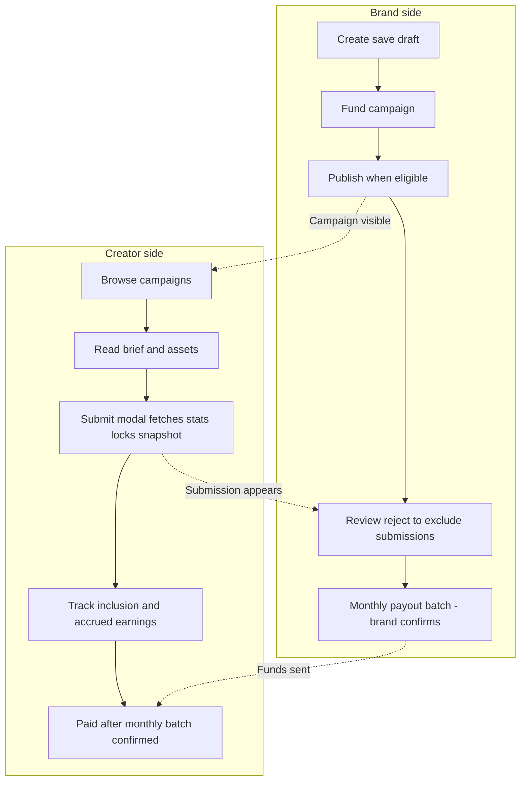

# Arpify MVP — product plan (hub doc)

**Audience:** product, engineering, ops, finance.

**What this folder is:** **Behavior and rules** for the MVP — what brands and creators do, how money moves, and what we ship in copy. **Sign-in and roles** (email or Google): [Auth & sign-in](02-auth-and-signin.md). This doc does not replace Terms or legal; we align legal text with what ships in the product.

---

## Skim: what the MVP does

| Who | What they do |
|-----|----------------|
| **Brand** | Draft campaigns; fund and top up; refund only [available](01-business-model.md#brand-refunds-available-only) balance; **Payout** minimums **≥ PHP 50** per 1k views and **≥ PHP 10,000** total budget ([Brand flow — Payout](04-brand-flow.md#payout-create-campaign)); publish when rules pass including **≥ PHP 10k** spendable in pool — see [Launch policies](06-policies-and-trust.md#launch-policies); submissions **count by default** — **reject** to exclude (**real-time** inbox or **monthly breakdown** before payout); **review and confirm** each **monthly** payout batch before money is sent. No weekly payout packages; no per-submission cash-out button for creators. |
| **Creator** | Browse campaigns; connect **TikTok** and/or **Meta** once per platform ([persistent OAuth](03-creator-flow.md#connect-tiktok-and-meta)); submit **content** — at submit time the platform reads **views and engagement from the platform API** and **locks that snapshot**; **on TikTok**, optionally declare **[yellow basket](03-creator-flow.md#tiktok-yellow-basket-submit)** (affects creator/platform split on **that** payout line); pay follows that snapshot **unless the brand rejects** the submission; earnings stack for the month; **paid after the monthly batch is confirmed by the brand** ([Monthly payout](01-business-model.md#4-monthly-payout)). Keep content **public** until the **later of** campaign end **or** one month after submit ([Retention](03-creator-flow.md#content-retention)). |
| **Trust** | Rules are written in the product; **stats come from TikTok/Meta APIs**, not typed in by the user; **rule check** at submit (AI or simpler rules); submissions **count unless the brand rejects**. Fraud-proofing is **not** guaranteed. |
| **Revenue** | **15%** of gross brand deposits (**platform fee**); on each **included** payout line, **default** **20%** of gross performance to Arpify and **80%** to the creator — **except** **TikTok [yellow basket](03-creator-flow.md#tiktok-yellow-basket-submit)** lines, where gross performance on that line splits **50/50** ([Two streams](01-business-model.md#where-arpify-makes-money-two-streams)). |

---

## Doc index

| File | What it contains |
|------|------------------|
| [00-launch-phase.md](00-launch-phase.md) | Launch order: interest → marketing site → closed beta (incl. case studies) → post-beta fixes → wider release → scale |
| [01-business-model.md](01-business-model.md) | **Revenue streams** (complete list + key %), default money-flow diagram, short stubs linking out to creator/brand/policies for submission lock-in, monthly payout, refunds |
| [02-auth-and-signin.md](02-auth-and-signin.md) | **Email** (verification) or **Google** (OAuth), same screen; Brand vs Creator; route rules; flowchart |
| [03-creator-flow.md](03-creator-flow.md) | Creator: sign-in pointer, OAuth, submit modal (**incl. TikTok yellow basket**), states, earnings UI, retention |
| [04-brand-flow.md](04-brand-flow.md) | Brand: sign-in pointer, campaign fields, **Payout** minimums (rate / total budget), draft → fund → publish, inbox, monthly payout view |
| [05-tech-stack.md](05-tech-stack.md) | Stack, API trust boundary, TikTok/Meta OAuth, submit pipeline, liveness checks |
| [06-policies-and-trust.md](06-policies-and-trust.md) | Launch defaults, trust pipeline, retention enforcement, critical paths, edge cases, ops checklist |

---

## Copy and naming (for UI and email)

**Positioning:** We position brands as paying for **real views** on **Facebook** and **TikTok** by running campaigns; **creators** join campaigns and publish **content**. We prefer clear benefits: grow verified views, pay for performance, partner with creators.

**Roles:** Only two account types: **Brand** and **Creator**. In role selection, we show what each does in one line, for example: Brand — *"I run campaigns and pay for views."* Creator — *"I join campaigns, publish content, and earn."* We add a short **Not sure?** link if people pick the wrong role often.

**Words:** We use **Creator** / **creators** in the app and emails. For **posts/links** creators submit and their **locked snapshots**, we say **content** (and **submission** when we mean the record in our system). We avoid **clip** / **clipper** in user-facing copy.

**Pay shown to creators (MVP):** The brand sets **gross** PHP per 1k views **in the brand UI**. On creator **campaign list** and **detail**, we show only **default headline pay per 1k** = **80%** of that gross (e.g. gross 10 → show **8** as the campaign rate). **Settlement** on each submission row uses the split **locked at submit** (**80/20** by default; **50/50** on gross performance for **TikTok yellow basket** rows — [Creator flow](03-creator-flow.md#tiktok-yellow-basket-submit)). We don’t show a separate platform fee line or creator-facing “you get 80% of…” wording on campaign cards. Brands and our internal money screens still use **gross** and **per-line** net/fee for accounting ([Fees](01-business-model.md#where-arpify-makes-money-two-streams)). Terms may still describe fees where required.

**After sign-in:** We route **Brand** accounts to brand home and **Creator** accounts to creator home (details: [Auth & sign-in](02-auth-and-signin.md)).

---

## Diagram: how brand and creator steps connect

If Mermaid doesn’t render in preview, we paste into [mermaid.live](https://mermaid.live) to export an image.

